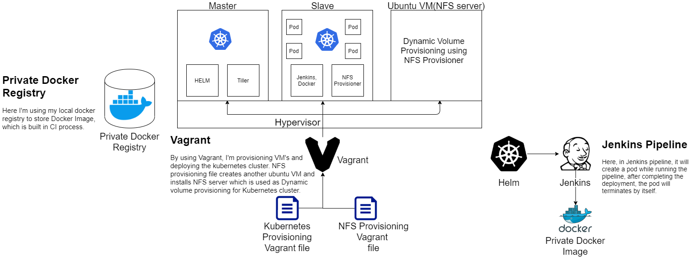

## Description of Solution
 
This project aims to build a Highly efficient and scalable Continuous Integration(CI) and Continuous Delivery/Deployment(CD) using Jenkins pipeline and to automate to CI/CD process to build a Docker Image in the local private registry and deploy the docker image to a Kubernetes cluster whenever there is a new commit in GitHub.
 
## Architecture
 

 
Here is the detailed architecture of the private cloud provisioning.
 
## Uniqueness of approach
 
In this project, the uniqueness of the approach is by using Vagrant, I'm provisioning VM's and deploying the Kubernetes cluster. 
NFS provisioning file creates another Ubuntu VM and installs NFS server which is used as Dynamic volume provisioning for Kubernetes cluster. 
Here, the Kubernetes plugin for Jenkins creates a Kubernetes Pod for each agent started, defined by the Docker image to run, and stops it after each build.
 
## Prerequisites
 
Install the following components.
1. [Virtualbox](https://www.virtualbox.org/wiki/Downloads)


In this project, using Virtualbox as a hypervisor for the project.
 
2. [Vagrant](https://www.vagrantup.com/docs/installation)


 
In this project, provisioning VM's and deploying the Kubernetes cluster by using Vagrant files. 
Using vagrant command on the specified directory, it will deploy the cluster.
```
vagrant up
```
To stop the cluster
```
vagrant halt
```
To destroy the cluster
```
vagrant destroy
```
3. [Docker](https://docs.docker.com/get-docker/)
 
In this project, using Docker to [build the image](https://docs.docker.com/engine/reference/commandline/build/) for Continuous Integration(CI) process.
 
4. [Docker registry](https://hub.docker.com/_/registry)
 
Docker registry is the Open Source Docker Registry implementation for storing and distributing Docker and OCI images using the OCI Distribution Specification. 
The goal of this project is to provide a simple, secure, and scalable base for building a registry solution or running a simple private registry.
This image contains an implementation of the Docker Registry HTTP API V2(Version 2)

Use a command like the following to start the registry container:
```
$ docker run -d -p 5000:5000 --restart=always --name registry -v docker:/var/lib/registry registry:2
```
This image contains an implementation of the Docker Registry HTTP API V2(Version 2)
```
$ docker container stop registry
```
To remove the container, use docker container rm.
```
$ docker container stop registry && docker container rm -v registry
```

5. [Helm](https://helm.sh/docs/intro/install/)
 
In this project, using Helm to deploy Jenkins with the custom Image [jenkins/jnlp-slave Image](https://hub.docker.com/r/joao29a/jnlp-slave-alpine-docker).
This image is based on jenkins/jnlp-slave running alpine with docker binaries.
 
6. [Jenkins](https://www.jenkins.io/doc/book/installing/)q


7. [Blue ocean plugin for Jenkins](https://plugins.jenkins.io/blueocean/)
 
Blue Ocean rethinks the Jenkins user experience and it is a Sophisticated visualization of CD pipelines.
 
8. [Kubernetes plugin for Jenkins](https://plugins.jenkins.io/kubernetes/)
 
This plugin creates a Kubernetes Pod for each agent started, defined by the Docker image to run, and stops it after each build.
 
[Scaling Docker with Kubernetes](https://www.infoq.com/articles/scaling-docker-with-kubernetes/), automates the scaling of Jenkins agents running in Kubernetes.
 
## Conclusion
 
Benefits of using this approach are highly available, scalable, resource-efficient and production-grade.
 