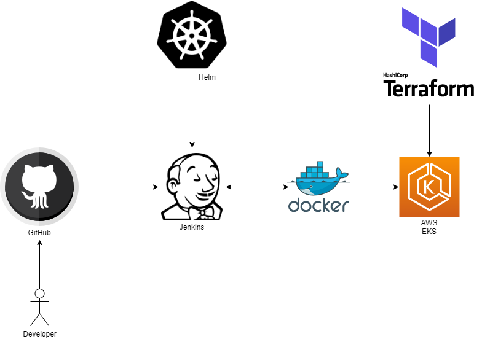

## Description of Solution

This project aims to build a Highly efficient and scalable Continuous Integration(CI) and Continuous Delivery/Deployment(CD) using Jenkins pipeline and to automate to CI/CD process and deploy the docker image to kubernetes cluster whenever there is new commit in github using public cloud AWS.

## Architecture



Here is the detailed architecture of the public cloud provisioning in AWS.

## Prerequisites

1. [Git](https://git-scm.com/book/en/v2/Getting-Started-Installing-Git)

For this project, Git is the distributed version control system. When a developer pushes the code to GitHub repository, code is pulled to Jenkins using poll scm or scheduled timmer. 

2. [Jenkins](https://www.jenkins.io/doc/book/installing/)

In Jenkins, the code from GitHub is build using tool Maven and creating a Docker Image from it and deploying the Docker Image to Kubernetes using the Kubernetes for Jenkins Plugin.

3. [Docker](https://docs.docker.com/engine/install/ubuntu/)

In this project, using Docker to [build the image](https://docs.docker.com/engine/reference/commandline/build/) for Continuous Integration(CI) process.

4. [Terraform](https://learn.hashicorp.com/terraform/getting-started/install.html)

For this project, Terraform enables us to safely and predictably create, change, and improve infrastructure.

Initialize a Terraform in the working directory
```
terraform init
```
Generate and show an execution plan
```
terraform plan
```
Builds or changes infrastructure
```
terraform apply
```
The terraform destroy command is used to destroy the Terraform-managed infrastructure.
```
terraform destroy
```

5. [Helm](https://helm.sh/docs/intro/install/)

In this project, using Helm to deploy jenkins with the custom Image [jenkins/jnlp-slave Image](https://hub.docker.com/r/joao29a/jnlp-slave-alpine-docker).

This image is based on jenkins/jnlp-slave running alpine with docker binaries.

6. [AWS EKS](https://aws.amazon.com/eks/)

Amazon Elastic Kubernetes Service (Amazon EKS) is a fully managed Kubernetes service. 

7. [AWS Cloudwatch](https://aws.amazon.com/cloudwatch/)

Amazon CloudWatch is a monitoring and observability service built for DevOps engineers, it used to watch the log files within AWS.

8. [AWS CLI](https://docs.aws.amazon.com/cli/latest/userguide/cli-chap-install.html)

The AWS Command Line Interface (CLI) is a unified tool to manage your AWS services. Using AWS CLI, we can configure all the services within AWS.

9. [Blue ocean plugin for Jenkins](https://plugins.jenkins.io/blueocean/)

Blue Ocean rethinks the Jenkins user experience and it is Sophisticated visualizations of CD pipelines.

10. [Kubernetes plugin for Jenkins](https://plugins.jenkins.io/kubernetes/)

This plugin creates a Kubernetes Pod for each agent started, defined by the Docker image to run, and stops it after each build.

[Scaling Docker with Kubernetes](https://www.infoq.com/articles/scaling-docker-with-kubernetes/), automates the scaling of Jenkins agents running in Kubernetes.

## Services

1. [Terraform](https://learn.hashicorp.com/terraform)

The Amazon Elastic Kubernetes Service (EKS) is the AWS service for deploying, managing, and scaling containerized applications with Kubernetes.

While you could use the built-in AWS provisioning processes (UI, CLI, CloudFormation) for EKS clusters, Terraform provides you with several benefits like Unified Workflow, Full Lifecycle Management, Graph of Relationships.

2. [Jenkins](https://www.jenkins.io/doc/)

Jenkins is a self-contained, open source automation server which can be used to automate all sorts of tasks related to building, testing, and delivering or deploying software.


3. [Docker](https://docs.docker.com/get-started/)

Docker is a platform for developers and sysadmins to build, run, and share applications with containers. The use of containers to deploy applications is called containerization.

4. [Kubernetes](https://kubernetes.io/docs/home/)

Kubernetes is a portable, extensible, open-source platform for managing containerized workloads and services, that facilitates both declarative configuration and automation. It has a large, rapidly growing ecosystem. Kubernetes services, support, and tools are widely available.

5. [AWS EKS](https://aws.amazon.com/eks/)

EKS runs the Kubernetes management infrastructure across multiple AWS Availability Zones, automatically detects and replaces unhealthy control plane nodes, and provides on-demand, zero downtime upgrades and patching.

## Conclusion

Benefits of using this approach is highly available, scalable, resource efficient and production grade.
